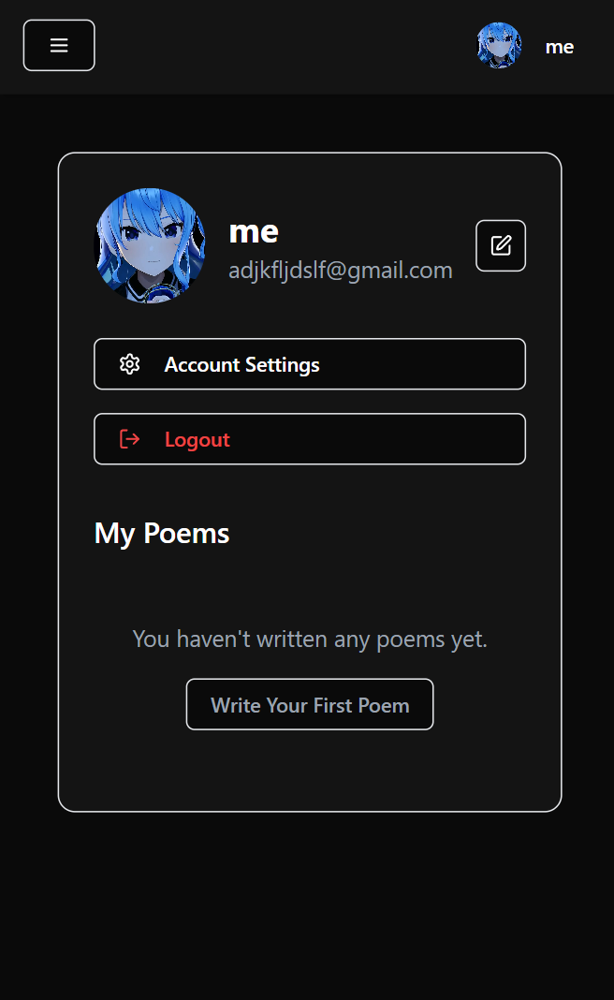

da fucking pfp is workin

# Poetry Site Project Progress

## ✅ Completed Features

### User Profile
- ✅ Profile avatar upload and management
- ✅ Basic profile information (name, email)
- ✅ Bio functionality
- ✅ View own poems and bookmarks

### Poem Features
- ✅ Create and view poems
- ✅ Bookmark system
- ✅ Basic sharing functionality
- ✅ Search poems by title and author

### UI/UX
- ✅ Dark mode implementation
- ✅ Responsive design
- ✅ Basic animations and transitions

## 🚀 Next Priority Tasks

### 1. Enhance Social Features
- [x] Add likes functionality for poems
- [x] Implement comment system
- [x] Add view count for poems

### 2. User Profile Improvements
- [x] Implement "Follow" system

### 3. Poem Management
- [ ] Enable poem editing and deletion
- [ ] Add rich text formatting
- [ ] Implement draft saving

### 4. Search & Discovery
- [x] Advanced search filters
- [ ] Recommended poems based on interests

### 5. Engagement Features
- [ ] Enable social media sharing
- [ ] Add poem collections/folders
- [ ] Show popular posts on the main page

## 🔄 Ongoing Improvements

### Security
- [ ] Implement rate limiting
- [ ] Add two-factor authentication
- [ ] Add password reset functionality
- [ ] Enhance error handling

### Performance
- [ ] Implement lazy loading for images
- [ ] Add caching for frequently accessed data
- [ ] Optimize database queries
- [ ] Implement infinite scroll

### Testing & Documentation
- [ ] Add unit tests for components
- [ ] Write API documentation
- [ ] Add end-to-end tests
- [ ] Create user documentation

## 📱 Mobile Features
- [ ] Add "write poem" widget
- [ ] Implement share to social media
- [ ] Add mobile notifications
- [ ] Support offline reading

## 📄 Documentation
For detailed documentation, please refer to the [Project Documentation](main.md).